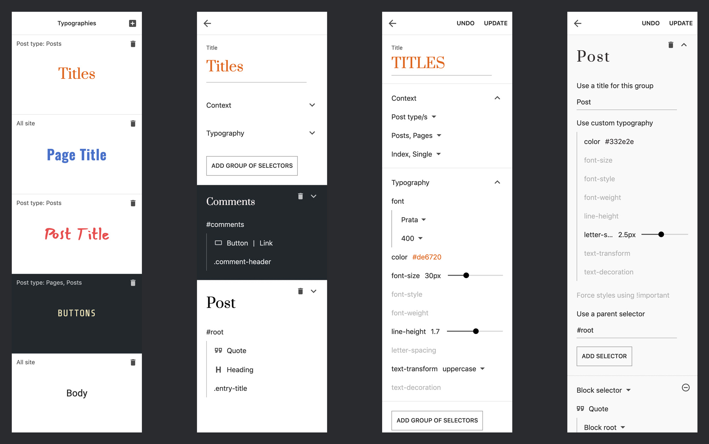
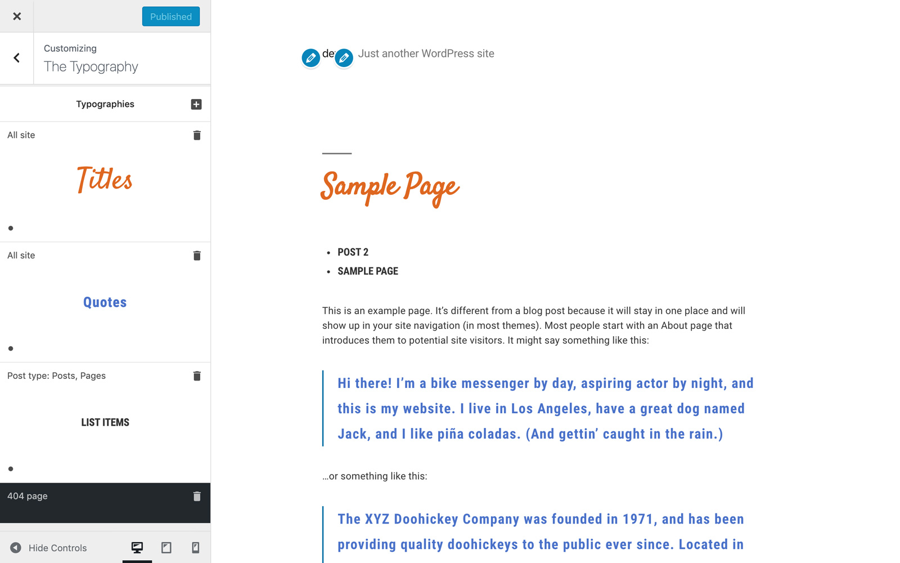

# The Typography

[Demo](https://gutenberg-showcase.melonpan.io/the-typography) - [Documentation](https://melonpan.io/wordpress-plugins/the-typography) - [WordPress](https://wordpress.org/plugins/the-typography)

 

Add Typography to your Gutenberg site using Google Fonts. Enter CSS selectors or select Blocks to apply custom typography.

 

## Typography style

Available typography options include:

- Font family & variants from Google Fonts
- Color (hex or rgba)
- Font size
- Line height
- Font weight
- Font style (italic, normal, oblique)
- Letter spacing
- Text transform (capitalize, uppercase, lowercase)
- Text decoration (line-through, overline, underline)

 

## Typography context

Typographies can be assigned to a specific context:

- All site
- Post types/s (post types available on the site)
- Post types/s template (index, single)
- Front page
- 404 page

 

## Typography selectors

Each typography can have several groups of selectors with unique modifications based on the root typography.
For example: a typography can be set with a certain Font, Color and Font size;
each of its groups of selectors inherit those properties and one could modify the inherited color and other the inherited Font size.

Available CSS selectors include:

- Text CSS selector (eg: .site-title a)
- Block Selector (eg: Block Quote > Citation)

 

## Screenshots

